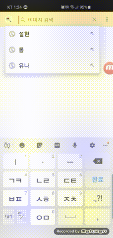

# Image Finder

Kakao 이미지 API를 활용해서 개발한 안드로이드 검색 애플리케이션입니다.

### 개발 개요

- [O] 사용언어 : Kotlin
- [O] 디자인 패턴 : MVVM
- [O] DI : Kotlin Koin
- [O] API : Retrofit2 + RxJava

## 1. 기능 시연

### 이미지 검색 기능


<br><br><br>

### 페이지 변경 기능


<br><br><br>

### 검색 옵션 변경 기능


<br><br><br>

### 새로고침 기능


<br><br><br>

### 이미지 상세정보 보기 기능


<br><br><br>

### 최근 검색어 표시 기능


<br><br><br>

### 이미지 크기 조절 기능


<br><br><br>

### 다중 선택을 통한 파일 이미지 공유 기능


<br><br><br>

## 2. 패키지 구성

개발에 사용한 소스코드 패키지는 Dokka로 문서화 되어있으며, 본 Git Repo의 GitHubPage와 연동되어 있습니다.

자세한 사항은 [링크](https://apexcaptain.github.io/ImageFinder/app/index.html)를 참고해주세요.

## 3. 빌드 정보

### SDK 버젼

```
compileSdkVersion : 28
minSdkVersion : 27
targetSdkVersion : 28
```

### 플러그인

```
apply plugin: 'com.android.application'
apply plugin: 'kotlin-android'
apply plugin: 'kotlin-android-extensions'
apply plugin: "kotlin-kapt"
apply plugin: 'org.jetbrains.dokka-android'
```

### Gradle 종속성

```
// Kotlin Koin Dependency Injection
implementation "org.koin:koin-android:$koin_version"
implementation "org.koin:koin-android-scope:$koin_version"
implementation "org.koin:koin-android-viewmodel:$koin_version"

// RxJava & RxAndroid
implementation "io.reactivex.rxjava2:rxjava:$rx_java_version"
implementation "io.reactivex.rxjava2:rxandroid:$rx_android_version"

// Retrofit2.
implementation "com.squareup.retrofit2:retrofit:$retrofit2_version"
implementation "com.squareup.retrofit2:adapter-rxjava2:$retrofit2_rxjava_adapter_version"
implementation "com.squareup.retrofit2:converter-gson:$retroift2_gson_converter_version"

// Glide dependency
implementation "com.github.bumptech.glide:glide:$glide_version"
annotationProcessor "com.github.bumptech.glide:compiler:$glide_compiler_version"

// Custom Layout Components
implementation "com.wang.avi:library:$wang_avi_process_indicator_version"
implementation "com.github.recruit-lifestyle:WaveSwipeRefreshLayout:$wave_swpie_refresh_layout_version"
implementation "com.github.shadowalker77:wp7progressbar:$wp_progress_bar_version"
implementation "com.linroid.filtermenu:library:$filter_menu_version"

// TedPermission
implementation "gun0912.ted:tedpermission:$ted_permission_version"
```

## 4. 개발자 정보

email : [ayteneve93@gmail.com](mailto:ayteneve93@gmail.com)  
mobile : +82)10-3224-9504
